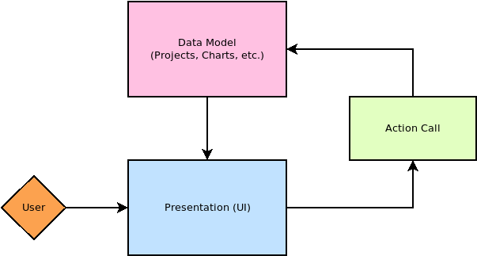

# Actions
Actions represent a command the user can trigger in the app. All menu items are bound to an action, though not all actions are bound to a menu item.

## Creating A New Action
Creating an action is straight forward:

1. Create a new class in OpenChart.UI.Actions which implements the `IAction` interface.
2. Register the action in [Application.cs](/OpenChart/src/Application.cs)
3. (Optional) If the action should be visible in the menu, add an entry in [MenuModel.cs](/OpenChart/src/UI/Actions/MenuModel.cs)

## Actions vs. Events
Actions and events are not replacements for each other. An action should be a simple task. At it's core it's nothing more than a way for an object to call a method on another object. The method may fire off its own events. If you imagine a complex task as a stack of dominos, all the action should be doing is tipping over the first domino.

For example, the [NewProjectAction](/OpenChart/src/UI/Actions/File/NewProjectAction.cs) changes the current project property. The result of that is of no concern to the action itself; it already did its job. It was asked to make a new project, so it made a new project. The follow-up to this should be handled with events, so things like the UI can update itself accordingly.

## Application Flow
Within the app there should be a clear distinction between the data model and what we are displaying to the user. What the user sees is a direct result of the data model. Hence, any changes in the data model should notify the presentation to update (which is handled through events usually).

Actions act as the liason between the user and the data model. This makes it easy to swap out and reuse UI components without the worry of losing app logic, since all the app logic exists outside of the UI. It also makes it easier to test the widgets since they are better isolated.

