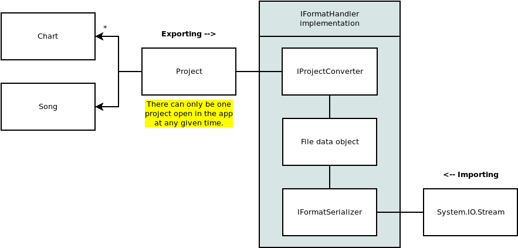

# File Formats

For several reasons -- including consistency and testing -- we want all of the file formats to use the same general process.

A single parser class is often bloated and fragile, so to make our lives easier we'll split up the parsing into two discrete steps:

1. Handle how the data is represented by the format.
2. Handle how that data can be used by the application.

The first step involves reading an IO stream and parsing the raw data into something useful, while the second step involves taking that data and reshaping it into a format that our application will understand.

This makes it easier to separate out the logic into multiple smaller classes rather than a single large one. It also means that we have a "window" into the parsing process. This helps with testing since now we can test both steps independently of each other.

## Design

A few interfaces exist to help make the process easy to follow.

- [**IFormatSerializer**](/OpenChart/src/Formats/IFormatSerializer.cs)
	+ Handles the IO and serialization/deserialization of the raw file data.
- [**IProjectConverter**](/OpenChart/src/Formats/IProjectConverter.cs)
	+ Handles the transformation between serialized file data and a `Project` object.
- [**IFormatHandler**](/OpenChart/src/Formats/IFormatHandler.cs)
	+ Bundles a serializer and converter together to make the parser easy to use.

This diagram shows how everything fits together. On the surface, the caller sees a file format handler as a black box that can read and write `Project` files.

## Importing

The serializer receives an IO stream. Some file formats may be easy to deserialize while others may need to be parsed character-by-character.

With the IO stream parsed, the serializer creates an instance of a "File data object". This is simply a data class used internally by the file parser that represents the data stored in the file. This class should ideally map one-to-one with the data in the file.

The file data object is then passed from the serializer to the converter, whose job is to take the object and somehow transform it into a `Project` object.

While OpenChart *is* meant to be universal, some fields may not be used within the app. In this case, the converter can safely ignore those extra fields. Note that it's the converter's responsibility to know what data we do and don't need. The serializer shouldn't discard data unless it's for a good reason. **We may decide to use that data in the future,** and it will be much easier if we don't have to modify the converter *and* the serializer.

## Exporting

The process for exporting is simply the reverse of the import process. The converter receives a `Project` object, converts it to a file data object, and then the serializer writes that object to an IO stream using the file format's syntax.

OpenChart supports exporting individual charts as well as exporting all the charts in a project.

In the case of a file format only supporting one chart per file, exporting the entire project will simply export each individual chart. However, if the format supports multiple charts per file (such as .sm), the parser will receive a single `Project` instance with all of the charts.
